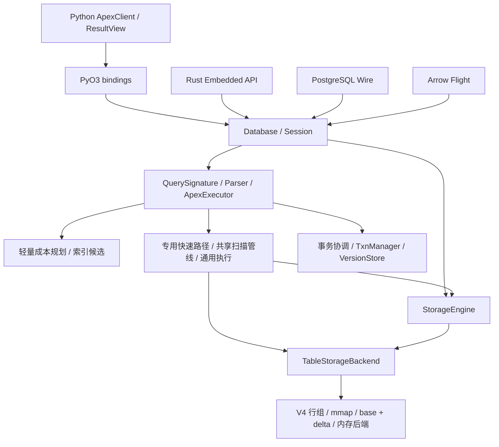

# ApexBase 架构评估与渐进式重构方案

> 评估日期：2026-09-06。代码快照：`d0f7d282502f9eeb948a20fc9fbeefce22a897cb`，版本 `1.33.1`。
> 本文为源码静态评估和实施建议，不代表重构已经实施，也不构成功能、性能或崩溃恢复验收。此次仅新增评估文档及导航，不修改运行时代码、测试、benchmark 或 AGENTS.md。

## 1. 总体判断

**建议保留现有 Rust 核心和 V4 存储，采用分阶段、可回滚的重构。第一优先级是事务提交的错误传播与一致性，其次是共享物理执行、状态归属和资源边界。当前没有足够证据支持推倒重写。**

ApexBase 已经形成有价值的技术基础：统一的 Database/Session 入口、列式行组存储、mmap 按需读取、base/delta 合并、Arrow 互操作、索引与统计、类型化扫描谓词，以及字典编码上的融合聚合。这些能力值得保留。

主要问题在于这些能力尚未完全围绕同一套执行和状态生命周期组织。快速路径、共享扫描和通用求值并存；事务管理器与存储提交分离；缓存由多个层级维护；大型源码文件承担过多决策。继续逐条增加 SQL 特例，可能使新查询组合更难预测、更难证明正确。

| 维度 | 当前判断 | 改进方向 |
| --- | --- | --- |
| 产品与技术路线 | 嵌入式、Rust 核心、Arrow 互操作的方向清楚 | 继续以单机可靠性和真实工作负载为中心 |
| 分层设计 | 已有统一入口和静态依赖约束，但入口统一不等于状态归属统一 | 收敛提交、缓存、会话与物理访问职责 |
| 存储设计 | V4 行组、delta、按需读取是有效基础 | 先强化一致性和读视图，暂不更换文件格式 |
| 查询执行 | 专用优化丰富，共享执行仍是局部纵向切片 | 逐步扩大可组合算子覆盖，保留低开销内核 |
| 事务与恢复 | 已有 OCC、版本存储和 WAL；提交错误处理存在明确缺口 | 优先建立可验证的提交协议与故障恢复行为 |
| 内存与并发 | 有按需存储和局部并行，未形成统一查询资源约束 | 分批执行、内存预算、取消和服务端背压 |
| 工程可维护性 | 有架构契约测试和严格性能门禁，但文件与文档仍需治理 | 按职责拆分，统一能力清单和验收记录 |

不对性能打主观分数，也不依据静态代码承诺相对 SQLite/DuckDB 的速度优势。

## 2. 当前真实架构

### 2.1 主要调用链



这是主要执行关系，省略目录、FTS、向量和缓存细节。执行器仍直接使用部分 backend 能力；图中的分支不能理解成所有查询必经完整规划器，也不能理解成所有读都已经通过共享扫描。

### 2.2 已经做对的部分

1. **上层入口收敛。** `database.rs` 的 `Session` 负责查询根目录、临时目录上下文的进入和恢复，Python、Embedded、Server、Flight 已有共同入口。静态测试禁止这些入口直接调用部分底层接口。
2. **存储不依赖 SQL 执行器。** `test_phase23_architecture_contracts.py` 明确约束 storage 内不得依赖 `crate::query` 或 `ApexExecutor`。这条依赖方向应继续保留。
3. **物理扫描协议已有类型边界。** `ScanValue` 保留 Int/UInt/Float/String/Bool，`ScanPredicateExpr` 支持 AND/OR，叶节点包含比较、区间、IN 和 NULL 判断；候选裁剪之后重新执行完整谓词。
4. **覆盖状态有正确性回退。** `TableStorageBackend::scan()` 检查 delta、pending delta 和内存行；存在覆盖层时走合并读取。对无法安全转换的宽整数与 UInt64，不强行使用旧的数值候选路径。
5. **已有真正减少中间结果的内核。** `on_demand/fused.rs` 直接遍历行组，在字典键与数值列上执行过滤聚合，支持借用视图和复用解码缓冲。这是通用执行演进可以吸收的经验。
6. **缓存失效已有共同基础。** `storage/epoch.rs` 维护表代际，`LogicalWrite` 合并嵌套写入的代际发布，并有跨客户端、事务提交、schema rewrite 的测试。
7. **已经约束真实性。** 同机 base/current 门禁保留交错样本、兼容性校验和回退确认；Python/Rust 路由共享语料已有一致性测试。

### 2.3 复杂度集中位置

以下为当前快照的物理行数，包含注释、空行及文件内测试，仅用于定位阅读与修改成本，不能直接等同于代码质量。

| 文件 | 行数 | 当前职责与风险 |
| --- | ---: | --- |
| `query/executor/select.rs` | 12,313 | SELECT 路由、候选判断、多种专用内核适配与通用回退集中 |
| `storage/backend.rs` | 6,896 | 存储访问、扫描适配、多种读写委托与缓存相关逻辑集中 |
| `query/executor/expressions.rs` | 6,881 | 表达式语义与大量函数实现集中 |
| `query/sql_parser.rs` | 6,877 | 语法、表达式解析及相关测试集中 |
| `python/apexbase/client.py` | 5,960 | 客户端状态、SQL 路由、结果转换、缓存和 API 集中 |
| `query/executor/joins.rs` | 4,560 | Join 与表解析相关能力集中 |
| `database.rs` | 583 | 已有薄 façade，适合继续作为稳定入口 |

拆文件本身不产生运行时收益。应按职责减少交叉依赖和重复决策，避免把一个大文件机械变成多个相互调用的小文件。

## 3. 关键发现与优先级

### A1 · P0：事务提交状态与持久化结果脱节

**已确认的代码事实：**

- `execute_commit_txn()` 首先调用 `TxnManager::commit_with_writes()`。
- 后者完成 OCC 校验后设置 `Committed`、移除活动事务，并将提交版本写入 VersionStore；之后才由执行器落到表存储。
- 执行器中多处 WAL 操作用 `let _ = ...` 忽略错误；打开 WAL backend 的失败也未向上返回。
- `apply_txn_writes()` 返回 `i64`，多处写入失败仅 `eprintln!` 后继续处理，外层最后可能返回已应用计数作为成功结果。
- UPDATE 在此处未逐条记录事务 WAL；后续索引保存则可能在数据已经应用后返回错误。

**影响判断：** 当前错误传播不能保证调用方区分完整成功与部分应用。多个表的 WAL 分别提交，单凭本路径也不能证明跨表崩溃原子性。这是可靠性优先事项，不能通过一次普通成功提交测试消除。

**尚未验证：** 故障发生时可见数据的具体组合、各 durability 模式的恢复覆盖、跨进程读到中间状态的条件。本次没有注入磁盘故障或运行 kill/reopen 测试，不能将所有风险描述为已经复现的数据损坏。

**建议：** 将校验、持久化、可见性发布和事务结束视为同一提交协议。先补真实故障复现，再设计最小的协调状态机。仅把日志改成 `?` 仍不足以撤销已经应用的写入；必须明确失败前后哪些状态允许重试、哪些状态需要恢复。跨表原子提交如需新增数据库级提交记录，应单独评审格式兼容与恢复协议，不能直接叠加未经验证的“两阶段”抽象。

### A2 · P1：共享扫描还不是分批物理流水线

`ScanRequest` 已存在，但 `scan()` 当前返回 `Option<Morsel>`，内部可能调用 `read_columns_to_arrow(..., 0, None)` 读取全部所需列。`try_scan_group_pipeline()` 随后调用 `into_record_batch()`，再交给 `execute_group_by()`。

这意味着共享协议目前主要统一选择语义，尚未普遍将内存占用约束为“一个批次加算子状态”。同时，融合聚合内核本身已经能按行组流式执行，不能把局部通用管线的限制概括为整个数据库都无法流式处理。

建议从单表 Filter → Aggregate → HAVING → TopK 扩展：先让读取端逐行组产生批次，聚合与 TopK 增量消费选择向量，再逐步延迟最终物化。对高基数 GROUP BY、全排序、Join 仍需单独的状态预算，分批扫描不会自动解决这些问题。

### A3 · P1：语义适配与物理选路仍然重复

Python 有 `_classify_sql_route()`，Rust 有 `QuerySignature`；共享路由语料能约束 route family，但详细快速路径仍需两侧维护。执行器中还同时存在 SQL AST 到 `ScanPredicateExpr` 和到 `FusedPredicate` 的适配。

SELECT 的一条 CBO 路径用 `QueryPlan.strategy` 判断是否跳过索引，然后再调用 `try_index_accelerated_read()` 提取执行条件。这表明规划信息在该路径中主要充当选择开关，尚非所有物理执行的唯一输入。

建议复用已存在的 `QueryPlan`/`ExecutionStrategy`，逐条使索引候选携带可直接执行的键、范围、残余谓词和物化信息；不要另起一套竞争的计划系统。SQL 语义由公共类型化层确定，融合内核保留紧凑的物理表示，在扫描之前完成 lowering，避免逐行动态分发。

Python 的纯客户端快捷操作可以保留。通过基准确定哪些分类值得移到已有 FFI 调用中，不为“统一分类”增加额外一次热路径 FFI。

### A4 · P1：缓存和会话生命周期分散

当前存在执行器的 `STORAGE_CACHE`、StorageEngine 的 backend 缓存、绑定层的 `cached_backends`、Python 查询结果缓存，以及索引、字典、统计、协议 schema 等缓存。`Database::cached_backend()` 仍委托执行器缓存，说明 façade 已统一调用入口，资源归属尚未统一。

`Session` 当前借用路径，通过 RAII 恢复线程局部上下文；执行器还有 `SESSION_VARS` 等 TLS 状态。调度器任务只携带 SQL 和 table path，Flight 则通过 `spawn_blocking` 执行。因此，会话跨线程传播需要专门验证，不能仅根据存在 `Session` 类型就推断所有入口的事务和临时对象语义完全一致。

建议先建立状态清单：owner、key、数据来源、容量、失效时机、关闭时机、跨进程行为。之后逐项明确唯一权威 owner，允许绑定层继续保留带代际校验的低开销引用缓存。不要把所有缓存简单合并成一把全局锁，也不要删除仍被引用的 mmap 所有者。

### A5 · P1/P2：按需存储与查询内存上限尚未打通

存储已有按需读取与增量落盘，但在本次检查的通用扫描、调度器和协议路径中，没有看到统一的查询内存预算、取消检查和准入控制贯穿执行。

`scheduler.rs` 是整条查询的线程池，队列采用 `VecDeque`；它不是 morsel 调度器。Flight 将查询先转成完整 RecordBatch，再用单元素流编码；传输接口是流不代表执行过程具有背压。`get_flight_info()` 也会执行查询取得 schema，需要评估之后 `do_get()` 再执行的成本与一致性。

建议先串行分批，明确内存所有权，再考虑并行。将执行预算与取消信息随查询上下文传递；服务端限制排队和并发，将取消传播到执行器；元数据请求优先走安全的 schema 推导。暂不让嵌入式点查询为服务端队列和遥测支付固定锁成本。

### A6 · P1：设计文档存在状态漂移

| 文档内容 | 当前证据 | 处理建议 |
| --- | --- | --- |
| 扫描文档仍描述合取列表和较早的谓词类型 | `scan.rs` 已有类型化 AND/OR/IN/NULL 谓词 | 后续同步能力表、限制及 fallback 条件 |
| 优化器路线图把复合 key、generation 等列为缺口 | 同一文档后续已勾选完成；源码已有相关结构 | 按源码、行为测试、验收证据重新标注状态 |
| Engineering Guidelines 禁止新增结果缓存 | Python 当前已有结果缓存及禁用/失效测试 | 明确现有行为与后续规则，不能仅据旧文档删除功能 |
| 旧路线图给 pytest 设 9 秒限制 | 当前 AGENTS.md 明确不设硬时间限制 | 后续普通文档对齐 AGENTS.md；不得修改 AGENTS.md |

本文记录这些矛盾，不把旧路线图中的勾选视为当前验收通过。本次不批量重写历史记录。

## 4. 目标设计

目标是收敛职责和数据流，不是增加一个庞大的框架。下面的名称表示职责，是否新增类型由实施阶段决定。

```text
Python / Embedded / PG / Flight
             │ 适配输入与输出，不持有独立 SQL 执行语义
      Database + Session
             │ 显式查询上下文与生命周期
     QuerySignature / Parser
             │ 快捷路由可直接选已有内核
      可执行的 QueryPlan
             │ 类型化谓词、访问路径、残余表达式
      物理算子与融合内核
             │ 分批输入 + selection + 增量状态
      存储读视图 / Scan
             │ base、delta、内存后端的统一可见性契约
      V4 / 索引 / 字典 / 编码

写入：事务校验 → 持久化协议 → 可见性及代际发布 → 完成
支撑：有明确归属的缓存、内存预算、取消、可选执行统计
```

关键契约：

- 物理内核可以多种实现，但类型、NULL、精确整数、残余谓词和结果排序语义必须一致。
- 候选裁剪只能保守缩小扫描范围；不支持的语义必须回退，不能近似处理后声称精确。
- 聚合消费选择向量；只在算子确需连续数组或返回边界进行 gather/物化。
- base 与 delta 的批次读取必须共享一致读视图，防止分批过程中重复、漏读和新旧 schema 混合。
- mmap/Arrow 借用数据的生命周期必须覆盖所有输出消费者，包括延迟 ResultView 和关闭客户端后的合法结果访问。
- 代际发布与成功逻辑写入协调；缓存失效不能代替事务可见性或恢复协议。
- 快速路径关闭诊断后不增加逐行分支、锁、I/O 或新的 FFI。
- 先使用静态调用、现有 enum 和借用；只有第二个真实消费者出现时才提取新公共抽象。

## 5. 分阶段执行计划

所有阶段均为建议，尚未开始实现。按独立变更批次推进，不承诺未经实测的工期或加速比例。每一阶段的完成标准同时包含本节目标和第 7 节验收。

| 阶段 | 工作与交付物 | 依赖 | 完成标准 | 回滚方式 |
| --- | --- | --- | --- | --- |
| R0：事实与基线 | 更新能力清单；固定 Git base、环境、查询语料、结果缓存设置；记录关键路径的现有耗时与内存 | 无 | 有可复现原始报告；实现/测试/性能证据分开列示 | 仅文档与诊断记录可独立撤回 |
| R1：提交正确性 | 复现 WAL/数据/索引失败；明确提交状态、错误传播、恢复及跨表语义；实现最小修复 | R0 | 不再把部分写入当成功；失败和重启行为符合明确契约；Rust/Python 覆盖 | 无格式变更优先；格式变更独立评审，禁止盲目旧二进制回退 |
| R2：职责拆分 | SELECT 按路由、索引访问、聚合 lowering、扫描适配、TopK 拆分；逐步清理 backend 委托职责 | R1 | 路由顺序、API、错误语义不变，交叉依赖减少；不出现新的重复实现 | 纯移动与行为变更分开提交 |
| R3：串行分批执行 | 扩展现有 scan 协议与稳定读视图；先覆盖 Filter/Aggregate/HAVING/TopK；融合内核继续可选 | R0、R1、R2 | 多批与单批结果一致；固定分组规模下扫描内存不随全表行数线性增长；目标性能有同机证据 | 内部选路保留旧实现，确认回退后关闭新路径 |
| R4：资源与状态归属 | 梳理 cache owner；显式传播会话上下文；预算、取消、协议背压及分批结果桥接 | 状态清单可在 R2 开始，流式交付依赖 R3 | close/reopen、跨客户端、跨进程与取消语义可验；缓存和队列可受控 | 每种缓存和每个入口单独迁移 |
| R5：规划与并行 | 让已有 QueryPlan 直接驱动物理访问；记录实际路径；按工作负载校准成本；最后评估 morsel 并行 | R3、R4 | EXPLAIN 与实际执行一致；简单查询无回退；并行有明确收益且无资源超订阅 | 保留固定/串行策略，收益不足不默认启用 |
| R6：按需求扩展 | 高基数聚合/排序/Join 的外部执行、FTS/向量组合计划、独立构建 feature | 真实 workload 与容量证据 | 每项有独立设计、兼容性与收益验收 | 未达到收益门槛不进入默认路径 |

R2 拆分中应优先复用已有 `aggregation/`、`dml/`、`mmap_scan/` 组织形式。不要同时拆 crate、换 parser、改格式和替换执行器。

### 第一批可落地任务：提交失败契约

1. 沿 `execute_commit_txn()`、`commit_with_writes()`、WAL recovery 和索引保存补齐时序图，分别描述单表/跨表、内存/磁盘、Fast/Safe/Max。
2. 构建真实临时数据库，通过受控 I/O 故障或子进程中断复现提交中途失败。故障钩子只能触发失败，不能 mock 掉实际写入与恢复路径。
3. 断言返回状态、活动事务、VersionStore、磁盘数据、索引、epoch 和重开结果，明确是否允许重试及如何避免重复应用。
4. 在故障契约明确后完成最小修复。优先不变更公开 API 与文件格式；必要变更单独提出设计，不能仅重新排列几行调用就宣布原子性成立。
5. 所有文件修改完成后统一运行完整功能与性能验收，保留失败样本和原始报告。

此批不顺手扩展 SQL 语法，也不修改扫描算法，便于定位正确性与性能变化。

## 6. 测试与测量覆盖建议

现有测试已经覆盖事务普通提交/回滚、重开、跨表操作、cache invalidation、宽整数扫描和 Boolean 聚合，实施时应扩展这些语义，避免重复建立一套只验证新函数的测试。

| 改动领域 | 必须验证的边界 | 应增加的性能场景 |
| --- | --- | --- |
| 提交与恢复 | WAL begin/DML/commit 失败；数据应用/索引保存失败；中途退出与重开；重试幂等；跨表与各 durability | 单行事务、批量提交、更新比例、跨表提交、delta 积累后的读写 |
| 分批扫描 | 空表、批次边界、NULL、UInt64、超过 2^53 的整数、NaN、未支持类型回退、删除/更新覆盖、并发写入读视图 | 选择率阶梯、投影宽度、行组数量、base-only 与 overlay、冷热文件缓存 |
| 聚合与 TopK | COUNT(*)/COUNT(col)、空组、高基数、HAVING 隐藏列、并列键、LIMIT/OFFSET、浮点归并误差、窗口回退 | 低/高基数、倾斜分布、小/大 K、Boolean/IN/range 的不同组合 |
| 缓存与生命周期 | 双客户端/双进程写入、DDL、drop/recreate、close/reopen、内存库隔离、结果持有期间关闭后端 | 点查缓存命中、失效频率、活跃表数量和缓存总内存 |
| 协议和调度 | 会话切换、临时表、事务跨请求、取消、慢消费者、队列饱和、线程切换 | 首批延迟、总延迟、并发吞吐、峰值 RSS、取消回收时间 |
| 物理计划 | 计划选路等于实际选路；索引残余条件完整；OR Union/AND Intersection/复合索引顺序一致 | 规划耗时、索引与扫描交叉点、物化成本、4–8 表真实 Join |

测量要求：

- 计算性能显式使用 `enable_cache=False`，记录设置；结果缓存收益另行测量。解析缓存、字典缓存、OS 页缓存不是查询结果缓存，需分别标明冷热条件。
- 分离读取、谓词、gather、聚合、排序、输出转换的成本；诊断关闭时不承担完整采样开销。
- 单独记录峰值 RSS、扫描/解码字节、物化行数和首批延迟。完整结果 API 本身可能需要 O(输出大小) 内存，不把它误判为扫描批次预算失败。
- 复杂查询性能断崖目前是结构性风险，必须用同一语义的小幅 SQL 变体和数据分布变化去证实，不能直接给出倍数。
- 性能收益的完成标准应绑定实际瓶颈。例如低基数组合查询验证分批内存曲线；点查验证延迟无回退；Join 先证明中间结果是瓶颈，再添加算法。

## 7. 实施验收与兼容性

后续代码修改以仓库 [AGENTS.md](https://github.com/BirchKwok/apexbase/blob/d0f7d282502f9eeb948a20fc9fbeefce22a897cb/AGENTS.md) 为强制约束，不能用本文替代或放宽。采用 conda base，所有最终文件修改完成后按顺序执行：

```bash
maturin develop --release
pytest
cargo test
python benchmarks/bench_vs_sqlite_duckdb.py
python benchmarks/run_local_perf_guard.py --base-ref origin/main
```

核心查询/存储热路径、架构阶段最终验收、发布前及其他 AGENTS.md 指定情形，追加：

```bash
python benchmarks/run_local_perf_guard.py --base-ref origin/main --mode full
```

- 普通门禁：200,000 行、2 次预热、7 次计时；完整模式：1,000,000 行、2 次预热、5 次计时。构建后默认至少等待 30 秒。
- 初始按 B-C-C-B-B-C 每侧三个样本；发现回退必须追加每侧两个样本，以五样本中位数判断。保留所有不利样本。
- 两侧同机、相同 Python/环境/依赖、release 构建且 Cargo 产物隔离；current 包含工作区有效修改。
- 不调大默认 15% 相对阈值与 0.005 ms 绝对阈值；两者同时超限判回退。退出码非 0 不得声称通过。
- 公开 benchmark 与仓库最新公开基线比较。本次确认 `benchmarks/latest_public_baseline.json` 存在，其配置为 1,000,000 行、2 次预热、5 次计时、`apex_result_cache=false`；这只是基线文件检查，不是重新运行 benchmark。实施时再次核实最新文件，不能以历史公开数值替代同机比较；若届时基线不存在，按 AGENTS.md 保存初始基线。
- “78 项”是 AGENTS.md 的验收称谓；实际指标集合随仓库扩展，以当前脚本和报告为准，不能裁剪到旧数量。报告应列出实际指标数和缺失检查。
- 报告保存在 `local-perf-results/<timestamp>/` 或明确指定目录，记录实际 base SHA，防止 `origin/main` 漂移导致阶段间对比不清。
- pytest 完整串行执行；记录 release 重装后首次冷态耗时，不设硬时间限制。完整 cargo 单元与文档测试均需通过。
- 每次原子修改检查范围、依赖方向、额外分配/锁/I/O、新增语义覆盖和回滚方式；完整性能测试集中到最终执行。

兼容性原则：保留 Python/Rust 公共 API、默认缓存行为、结果类型、SQL 错误语义和文件读取兼容性。内部流式接口先适配现有返回类型；公开流式 API、事务保证变化、文件格式变化应单独设计。数据格式迁移必须有版本检查、失败恢复和回退边界。

## 8. 暂缓的方案

- **整体重写执行器或存储引擎：** 当前没有全链路证据证明重写收益足以覆盖语义、性能和格式迁移风险。
- **直接接入另一套通用优化器：** 先让已有 QueryPlan 与执行器一致；若后续 SQL 复杂度确实需要外部组件，再按现有优化器路线图做独立原型评估。
- **先拆成多 crate 或服务化：** 文件和职责问题可以先在现有 crate 内解决，不能靠包边界掩盖循环依赖。Cargo 已有 Python/server/flight feature，但 JIT 等仍需具体成本测量后再决定可选化。
- **先做分布式：** `scaling/` 中存在节点、分片、路由结构，不等于已经有完整分布式执行与一致性协议；本次不据模块名称推断产品能力。
- **无预算地全面并行化：** 先完成读视图、分批执行、取消与内存边界，再测线程数和归并成本，避免与现有 Rayon、查询线程池、Tokio 阻塞任务竞争。
- **继续堆叠特定 SQL 文本优化：** 新优化优先落在公共扫描、编码或算子内核，通过真实数据分布和语义变体证明复用价值。

## 9. 源码证据索引

源码链接固定到本次评估的 Git 提交，避免后续主分支变更导致证据漂移。定位以函数/类型名称为准。

| 证据 | 定位与用途 |
| --- | --- |
| [Database/Session](https://github.com/BirchKwok/apexbase/blob/d0f7d282502f9eeb948a20fc9fbeefce22a897cb/apexbase/src/database.rs) | `Session::enter`、`QueryScope::drop`、`Database::cached_backend`：入口与缓存归属 |
| [存储引擎](https://github.com/BirchKwok/apexbase/blob/d0f7d282502f9eeb948a20fc9fbeefce22a897cb/apexbase/src/storage/engine.rs) | `get_read_backend`、`invalidate`：缓存与只读边界 |
| [扫描协议](https://github.com/BirchKwok/apexbase/blob/d0f7d282502f9eeb948a20fc9fbeefce22a897cb/apexbase/src/storage/scan.rs) | `ScanValue`、`ScanPredicateExpr`、`Morsel`：精确类型与批次协议 |
| [Backend](https://github.com/BirchKwok/apexbase/blob/d0f7d282502f9eeb948a20fc9fbeefce22a897cb/apexbase/src/storage/backend.rs) | `scan`、`scan_candidate_indices`：overlay 判断、候选与完整谓词 |
| [SELECT](https://github.com/BirchKwok/apexbase/blob/d0f7d282502f9eeb948a20fc9fbeefce22a897cb/apexbase/src/query/executor/select.rs) | `try_scan_group_pipeline`、`cbo_skip_index`：物化与物理选路 |
| [融合内核](https://github.com/BirchKwok/apexbase/blob/d0f7d282502f9eeb948a20fc9fbeefce22a897cb/apexbase/src/storage/on_demand/fused.rs) | `FusedPredicate`、`FusedLaneView`：紧凑内核及行组处理 |
| [规划器](https://github.com/BirchKwok/apexbase/blob/d0f7d282502f9eeb948a20fc9fbeefce22a897cb/apexbase/src/query/planner.rs) | `QueryPlan`、`PlannerContext`、`plan_select_details`：现有规划能力 |
| [事务协调](https://github.com/BirchKwok/apexbase/blob/d0f7d282502f9eeb948a20fc9fbeefce22a897cb/apexbase/src/query/executor/dml/coordination.rs) | `execute_commit_txn`、`apply_txn_writes`：提交顺序与错误处理 |
| [事务管理器](https://github.com/BirchKwok/apexbase/blob/d0f7d282502f9eeb948a20fc9fbeefce22a897cb/apexbase/src/txn/manager.rs) | `commit_with_writes`：OCC、提交状态和版本发布 |
| [存储恢复](https://github.com/BirchKwok/apexbase/blob/d0f7d282502f9eeb948a20fc9fbeefce22a897cb/apexbase/src/storage/on_demand/storage_core.rs) | WAL recovery、提交事务筛选、增量数据：恢复审计入口 |
| [代际管理](https://github.com/BirchKwok/apexbase/blob/d0f7d282502f9eeb948a20fc9fbeefce22a897cb/apexbase/src/storage/epoch.rs) | `SharedEpoch`、`LogicalWrite`：表版本与发布 |
| [执行器状态](https://github.com/BirchKwok/apexbase/blob/d0f7d282502f9eeb948a20fc9fbeefce22a897cb/apexbase/src/query/executor/mod.rs) | `STORAGE_CACHE`、`SESSION_VARS`、表写锁与索引缓存 |
| [Python 客户端](https://github.com/BirchKwok/apexbase/blob/d0f7d282502f9eeb948a20fc9fbeefce22a897cb/apexbase/python/apexbase/client.py) | `_classify_sql_route`、`_execute_impl`、`_query_result_cache` |
| [查询调度器](https://github.com/BirchKwok/apexbase/blob/d0f7d282502f9eeb948a20fc9fbeefce22a897cb/apexbase/src/query/scheduler.rs) | `QueryTask`、`submit`、`execute_query`：队列与上下文 |
| [Flight](https://github.com/BirchKwok/apexbase/blob/d0f7d282502f9eeb948a20fc9fbeefce22a897cb/apexbase/src/flight/service.rs) / [PG](https://github.com/BirchKwok/apexbase/blob/d0f7d282502f9eeb948a20fc9fbeefce22a897cb/apexbase/src/server/handler.rs) | 完整结果转换、schema 获取与 Session 入口 |
| [分层契约](https://github.com/BirchKwok/apexbase/blob/d0f7d282502f9eeb948a20fc9fbeefce22a897cb/test/test_phase23_architecture_contracts.py) / [路由契约](https://github.com/BirchKwok/apexbase/blob/d0f7d282502f9eeb948a20fc9fbeefce22a897cb/test/test_query_architecture_contracts.py) | 静态边界、共同语料、Boolean/宽整数与 fallback 测试 |
| [缓存契约](https://github.com/BirchKwok/apexbase/blob/d0f7d282502f9eeb948a20fc9fbeefce22a897cb/test/test_cache_invalidation_contract.py) / [事务测试](https://github.com/BirchKwok/apexbase/blob/d0f7d282502f9eeb948a20fc9fbeefce22a897cb/test/test_transactions.py) | 当前正常路径与失效语义的覆盖基础 |
| [门禁脚本](https://github.com/BirchKwok/apexbase/blob/d0f7d282502f9eeb948a20fc9fbeefce22a897cb/benchmarks/run_local_perf_guard.py) | `SAMPLE_ORDER`、`benchmark_arguments`、工作区快照与完整模式 |

相关设计：[存储架构](STORAGE_ARCHITECTURE.md)、[扫描架构](SCAN_EXECUTION_ARCHITECTURE.md)、[优化器路线](QUERY_OPTIMIZER_ROADMAP.md)、[工程约束](ENGINEERING_GUIDELINES.md)、[HTAP 路线](HTAP_ROADMAP.md)。本文是该快照的评估与建议；后续实施应更新阶段状态并附功能、故障恢复和同机性能证据。
## 10. 实施状态（R1：提交正确性）

状态：已完成，验收证据见下。本阶段未变更公开 API 与文件格式；改动已提交为 `origin/main`（d0f7d28）之上的 3 个 commit（`dc691d5`、`323220f`，另加本文档 `45663d4`）。

### 10.1 提交契约与实现

- **两阶段提交**：`TxnManager::prepare_commit`（OCC 校验 + 预留写意图）→ 协调层执行 WAL begin/DML/commit marker → `finalize_commit`（发布 committed_writes、VersionStore、水位与快照释放）。WAL commit marker 是提交点：其前失败回滚并传播错误；其后失败则事务已在 WAL 中持久提交，错误仍向调用方传播，行在下次 open 恢复收敛，调用方不得重试 DML。部分写入不再被当作成功返回。
- **崩溃恢复**：safe/max 表 open 时按 WAL 水位 sidecar（`<table>.apex.wal.meta`，8 字节已应用长度）门控，稳态 open 仅 stat + 8 字节读。恢复时截断 torn 尾批、重建缺失的已提交 insert、重放已提交 delete，并以 `is_live_txn` 跳过本进程在途提交，避免重复应用。
- **错误传播**：COMMIT 失败时 Rust 侧清除 `current_txn_id`、Python 侧清除 `_in_txn` 并抛出原始错误，两层客户端状态不再残留。
- **附带修复（R1 验收中发现）**：`try_dict_indexed_read` 的 `_id` 投影曾返回 0 基文件偏移而非真实行 ID（行 ID 自 1 起），`SELECT _id ... WHERE string_col = 'v'` 结果错位；改为经 `read_ids_by_indices` 读取真实 ID，canary 新增指标 "Projected _id string equality" 覆盖该路径。
- **附带修复（canary 回退定位）**：恢复引入的 `delta_complete_batches` 双遍扫描使每次 delta 读多走一遍文件，canary 初判 2 项聚合指标回退；按既有 `DELTA_ROW_COUNT_CACHE` 模式加 (len, modified) 键的批次边界缓存（`DELTA_BATCH_CACHE`，128 上限，delta 重写/删除时失效），稳态 delta 读恢复单遍成本，复测 canary 通过且相关指标改善。

### 10.2 验收证据（conda base，release 构建，同机 M1 Pro 10 核）

| 项目 | 结果 |
| --- | --- |
| 完整串行 pytest | 1746 passed |
| 完整 cargo test --release | 517 单元 + 6 文档测试 passed |
| 公开 benchmark（1M 行，2 预热 5 计时） | 72 项表格 + 6 项向量全部执行；向量 6/6、量化 6/6 胜出；报告 `benchmarks/results/r1_public_20260907.json` |
| 本地同机 canary（base=origin/main，200K 行） | 通过，55 指标，报告 `local-perf-results/20260907-005334/` |
| 本地同机完整模式（1M 行，109 项 + Q/s + 量化） | 通过，报告 `local-perf-results/20260907-030635/` |

完整模式说明：首次完整运行（`local-perf-results/20260907-010903/`）在 5 样本中位数判定中仅 INTERSECT (ordered) 一项 +26.69%（其余指标含 Q/s、量化均通过）。对该指标做了 40 次/侧、逐窗口交错的聚焦 A/B：base 中位数 0.896 ms vs current 0.811 ms（current 更快，分布更窄），判定为首轮采样窗口的测量噪声；重跑完整门禁（`20260907-030635/`）109 项全部通过，此前波动指标（INTERSECT/UNION/COUNT(*)/ORDER BY LENGTH）均落在 ±4% 内。两轮的原始样本全部保留。

环境说明：验收期间机器后台负载约 5（含浏览器进程），亚毫秒级指标的跨运行波动明显（不同运行标记的指标集合不一致）；回退判定以同机 base/current 门禁与聚焦 A/B 为准，公开基线（`benchmarks/latest_public_baseline.json`，492956bb）仅用于趋势与执行完整性，未据此放宽任何结论。

新增测试：`on_demand/tests.rs` +8（7 个恢复用例 + 1 个 delta 批次缓存失效用例）、`backend.rs` +1（`_id` 投影回归）、`test_commit_crash_recovery.py`（kill -9 全有全无与失败提交收敛，5 用例）、`test_transactions.py` +1（冲突提交后客户端状态清除）、`test_query_architecture_contracts.py` +1（`_id` 投影回归）。

### 10.3 残余风险（进入后续阶段前记录）

1. 恢复重建的行位于 delta 层，索引快路径有 `!has_delta()` 守卫不会漏读；delta 被 compact 进 base 时的索引重建路径未专门测试。
2. UPDATE 无逐条 WAL 记录（现有格式），恢复只保证 insert/delete 的 WAL 收敛；UPDATE 的崩溃窗口语义仍是尽力而为。格式变更需独立评审。
3. 跨表原子提交记录尚未引入（各表 WAL 独立记录），跨表 commit 的恢复粒度为按表收敛。
4. `open_txn_wal_backend` 固定 Safe 级别：Max 表的 commit marker 不 fsync（既有行为，本阶段未变更）。
5. 公开 benchmark 的跨日对比在亚毫秒指标上波动大，不宜单独作为回退证据。

## 11. 实施状态（R2：职责拆分）

状态：已完成（9 个纯移动 commit），阶段最终验收通过。本阶段零行为变更：路由顺序、公开 API、错误语义不变，无新增重复实现；每个 commit 只移动代码，不修改任何函数体。

### 11.1 拆分明细

新文件均为 split impl block 形式：顶层 `impl ApexExecutor { ... }`，经 `query/executor/mod.rs` 的 `include!` 文本纳入同一模块（与既有 `select.rs`/`joins.rs`/`window.rs` 及 `dml/` 子模块的组织形式一致），因此无需任何可见性调整，跨文件方法调用（ddl/joins/topk 等）保持原样。

| 新文件 | 职责 | 行数 |
| --- | --- | --- |
| `index_access.rs` | 索引加速读取：`try_index_accelerated_read`、谓词提取（`extract_index_predicates` / `is_fully_indexable_predicate` / `lookup_index_expression`）、index-only scan、行 ID 交并、`table_has_index_catalog` | 699 |
| `topk.rs` | ORDER BY+LIMIT top-k：数值过滤、NOT NULL、通用排序索引、批次补全 | 369 |
| `fused_group.rs` | 融合 GROUP BY：谓词树解析（`extract_fused_predicate`）、聚合 lane、精确/epsilon 边界 | 787 |
| `scan_pipeline.rs` | 扫描谓词 GROUP BY 族：filter+group+order、`build_scan_predicate`、cached transform/ratio/numeric、v4 | 1396 |
| `late_materialization.rs` | 扫描适配：SELECT * / ORDER BY / GROUP BY 的 late materialization | 825 |
| `fts.rs` | FTS：MATCH()/FUZZY_MATCH() 压缩 bitmap 解析与 score 投影 | 262 |
| `topk_vector.rs` | 向量 top-k：`topk_distance` 模式检测与距离计算 | 400 |
| `file_fast_paths.rs` | 外部文件快路径：CSV/JSON/Parquet count/聚合与文件读取器过滤下推 | 832 |
| `predicate_extract.rs` | 谓词提取助手：LIKE/IN/BETWEEN/比较/区间模式 | 334 |

`select.rs` 从 12313 行降至 6440 行，保留分发器 `execute_select_with_base_dir`（按计划路由最后拆）及 count/distinct、字符串/数值过滤、mmap 扫描快路径族。

对应 commit（`origin/main` d0f7d28 之上）：`80162ed` index_access、`eb7f20c` topk、`9e05399` fused_group、`1f1598b` scan_pipeline、`499baea` late_materialization、`f5b8628` fts、`d8bdf10` topk_vector、`c1e202d` file_fast_paths、`7da4db2` predicate_extract。

### 11.2 纯移动纪律与编译警告

- 每个 commit 的移动内容与移动前文件逐行一致（脚本核验：新文件无非包装行不属于原 `select.rs`；`select.rs` 除被移动块与其分隔空行外零增删），函数签名、doc 注释、逻辑均未改动。
- `include!` 为同模块文本纳入，未引入新的模块边界或 `pub(in ...)` 可见性变化；`dml/`、`aggregation/` 等既有子模块不受影响。
- 最终完整门禁的独立 release 构建为 197（基线）→ 201 条 warning：新增的 4 条报告记录来自同 5 个既有死函数（`try_fast_v4_group_by`、`try_fast_simple_agg`、`extract_bool_equality`、`try_fast_filter_groupby`、`execute_with_groupby_late_materialization`）由 rustc 在原文件中的 1 条“多函数未使用”警告，拆分后按 5 个文件分别报告；死代码集合与基线完全一致，未新增死代码。按 AGENTS.md，既有 warning 不在本阶段顺手治理。

### 11.3 验收证据（conda base，release 构建，同机 M1 Pro 10 核）

| 项目 | 结果 |
| --- | --- |
| 分批功能验证（9 批，逐批） | 每批：cargo check + 完整 cargo test --release（517 单元 + 6 文档）+ 完整串行 pytest（1746 passed），全部通过 |
| 完整串行 pytest（release 重装后冷态首跑） | 1746 passed in 21.88s |
| 完整 cargo test --release | 517 单元 + 6 文档 passed |
| 公开 benchmark（1M 行，2 预热 5 计时） | 103/103 项执行 + 向量 6/6 胜出；报告 `benchmarks/results/r2_public_20260907.json` |
| 本地同机 canary（base=origin/main，200K 行） | 通过，55 指标，报告 `local-perf-results/20260907-085433/` |
| 本地同机完整模式首轮（base=`d0f7d28`，1M 行） | 初判 2 项回退 → 五样本终判 1 项回退（Filtered aggregation (city) +23.89%）；聚焦 A/B 判定为采样噪声，见下；报告 `local-perf-results/20260907-090753/` |
| 本地同机完整模式复核（base=`d0f7d28`，同参数） | 一轮因 IN subquery COUNT 的窗口尖峰退出 1，原始报告与聚焦 A/B 全部保留；报告 `local-perf-results/20260907-122834/` |
| 本地同机完整模式最终重跑（base=`d0f7d28`，同参数） | 通过；初判 2 项回退后自动扩展，五样本终判 109/109 通过，Q/s 2/2、量化向量 8/8 通过；报告 `local-perf-results/20260907-140211/` |

公开 benchmark 与基线（`latest_public_baseline.json`，492956bb）对比：15 个工作负载组中 12 组持平或改善（-15.9% ~ -0.6%）；Aggregation +6.6%、Set Operations +13.3%、Subqueries & CTE +58.9% 为亚毫秒级负载（绝对 3.5 → 5.6 ms）的跨运行波动，该两项 ApexBase 仍 4/0 快于 SQLite/DuckDB。回退判定以同机 base/current 门禁为准。

完整模式首轮（`local-perf-results/20260907-090753/`）说明：五样本中位数下仅 `Filtered aggregation (city)` 0.448 → 0.555 ms（+23.89%，相对与绝对阈值同时超限）判为回退；原始样本显示 current 侧 5 个样本中 2 个为 3~5 倍孤立尖峰（1.606 / 1.981 ms），而 base 侧无同级尖峰，相邻同构指标 `Filtered aggregation (category)` 在 current 侧反而更快（0.428~0.454 ms）。随后对该指标做 40 次/侧、逐窗口交错（base10→current10×4 窗口）的聚焦 A/B（同一 1M 行数据集，两侧均 warm）：base 中位数 0.3125 ms vs current 0.3000 ms（**-4.01%，current 更快**），p10/p90 几乎重合（0.237/0.436 vs 0.239/0.430），且两侧均出现同级孤立尖峰（base 0.527/0.513，current 0.888/0.606）。判定为首轮采样窗口的测量噪声，与 R1 首轮 INTERSECT (ordered) +26.69% 的处理路径一致；未删除任何样本、未调整阈值，原始报告全部保留。

固定基线复核（`local-perf-results/20260907-122834/`）中，五样本终判仅 `IN subquery COUNT` 为 0.663 → 1.569 ms（+136.50%），current 五个样本为 0.763/2.022/1.569/0.680/4.631 ms，3 个尖峰推高了中位数；对应 base 为 0.632/0.865/0.632/0.663/0.697 ms。使用同一 1M 行数据库、相同 SQL 和两侧 release wheel 做 40 次/侧、4 个 base10→current10 窗口的聚焦 A/B，base 中位数 0.4167 ms、current 0.4279 ms（+2.69%），两侧均有窗口漂移且 current 有 1.04/2.14 ms 孤立尖峰；报告保存在 `local-perf-results/20260907-122834/focused-in-subquery/`。该失败不被覆盖或删除，阶段完成依据是随后从头执行、退出码为 0 的完整门禁（`local-perf-results/20260907-140211/`），其五样本终判 109 项全部通过。

### 11.4 残余与后续

1. 路由分发仍保留 count/distinct、字符串/数值过滤、mmap 扫描快路径族的派发；R3 扩展扫描协议后，该族可沿新协议边界继续拆分。
2. `topk.rs`（标量 top-k）与 `topk_vector.rs`（向量 top-k）按执行形态分列；若 R6 引入向量组合计划再统一重组。
3. 本阶段未触碰 `mmap_scan/`、`aggregation/`、`dml/` 内部结构，也未修改 backend 委托接口；"逐步清理 backend 委托职责"在 R3 共享扫描协议落地时一并处理。

## 12. 实施状态（R3：串行分批执行）

状态：已完成，阶段最终验收通过。完整模式首轮（五样本终判 4 项回退）经聚焦 A/B 判定为采样噪声后，由随后从头执行、退出码为 0 的完整门禁作为阶段完成依据（与 R2 首轮的处理路径一致）；所有原始报告保留。

### 12.1 实现明细

**存储侧**（`storage/scan.rs`、`storage/on_demand/mmap_scan/projection.rs`、`storage/backend.rs`）：

- `RgBatchStream`：按行组迭代稳定读视图。创建时快照 footer 与 mmap `Arc`，流内视图稳定；每行组一个 `RecordBatch`（活动行、删除向量生效、输出普通字符串数组，不做字典编码）。
- 保守 zone-map 行组裁剪：缺 zone-map、非数值列、有损 int→float 转换、`NotEq`、`IsNull` 永不剪；`AND` 任一可证不相交即剪、`OR` 需两侧均可证；zone-map 覆盖删除前数据，只会扩大真实范围，故"证空"在删除后仍为空。
- `BatchMorselStream`：对每个行组批次重放完整 `Morsel::select` 类型化谓词语义；`Unsupported` 列类型整体回落单批路径。
- `TableStorageBackend::scan_batches()`：仅当读视图为纯持久化 V4（无 delta 文件、无 pending DeltaStore、无 pending V4 行、非内存表）时开放，其余状态返回 `None` 回落 `scan()`。

**执行器侧**（`query/executor/batch_group.rs` 新增 796 行、`scan_pipeline.rs` 接线）：

- `try_batch_group_pipeline`：门控内的增量分组内核（≤2 键：int/float/bool/string；COUNT/SUM/AVG/MIN/MAX；NULL 键单组；聚合语义对齐单批内核族），HAVING 额外聚合注入、HAVING→TopK→LIMIT 顺序与单批路径一致。
- `try_scan_group_pipeline` 先试批量管道，门控外（形状/表状态/列类型）回落单批；`APEX_BATCH_SCAN=0` 可整体关闭批量切片做 A/B 诊断。
- 路由事实（本轮探针实测确认）：批量切片只经 `try_scan_group_pipeline` 到达；旧 fused 快内核先派发并保留其形状（单字典键 GROUP BY + ≤1 个值聚合，与 `APEX_BATCH_SCAN` 无关）。多键、多值聚合、fused lane 预算外谓词才到达批量切片；这也是内存有界测试与 A/B 矩阵采用 2 键/多聚合形状的原因。
- 谓词协议补全：负数字面量（解析为 `UnaryOp(Minus, literal)`）折叠进 `build_scan_predicate`，使负边界范围保持类型化协议内（此前整条扫描管道被静默降级到通用路径）；非字面量取负保持保守回落。
- canary 新指标：`File-table Filter+GROUP+HAVING+TopK (batch)`（`bench_batch_scan_group_having_topk`：delta 无关的基表文件副本 + 4 组轮换参数），扩展性能门禁覆盖面。

**既有 bug 修复（被 R3 测试暴露，均含回归测试）**：

1. 2 键（string+int）快路径静默丢弃 SELECT 中的 MIN/MAX 列 → `min_max_in_select` 门控回落完整增量内核（`aggregation/grouped.rs`）。
2. 3+ 键快路径 `build_multi_column_result` 丢弃 SELECT 别名（输出 `COUNT(*)` 而非别名）→ ORDER BY 别名解析失败、跨进程结果非确定性 → 增加 `agg_alias` 参数（`multi_column.rs` 及调用方）。
3. `compare_array_values`（`window.rs`）缺 Boolean 分支 → bool ORDER BY 全部判等 → 已补。
4. 批量内核自身三处缺陷（新代码，测试暴露）：SUM 字段 nullability、Bool 分组键 slot 编码、单键打包移位（`(id1 as u64) << 32`，3 处）。

### 12.2 测试覆盖

| 层 | 测试 | 覆盖点 |
| --- | --- | --- |
| Rust 存储 | `scan_batches_stream_matches_single_shot_scan_over_multi_rg_table` | 70k 行/3 行组/删除/NULL/谓词，分批拼接 == 单批 |
| Rust 存储 | `scan_batches_requires_a_clean_persisted_read_view` | delta/pending 状态保守拒绝 |
| Rust 执行器 | `batch_group_pipeline_executes_gated_shapes_and_falls_back_outside_gate` | 门控内形状、3 键回落、delta 回落 |
| Rust 执行器 | `batch_scan_pipeline_matches_single_batch_pipeline` | 8 查询 env A/B + delta 回落（`BATCH_SCAN_ENV_LOCK` 串行化） |
| Rust 执行器 | `two_key_string_int_group_by_keeps_min_max_columns` | MIN/MAX 丢弃回归 |
| Rust 执行器 | `three_key_group_by_keeps_alias_and_sorts_deterministically` | 别名 + bool 排序确定性回归 |
| Rust 执行器 | `negative_bound_predicates_stay_in_typed_scan_protocol`、`negative_bound_group_by_keeps_exact_results_in_both_env_states` | 负数边界谓词结构 + 显式值正确性 |
| Python | `test/test_batch_scan_pipeline.py`：7 查询 A/B 矩阵（5 形状探针确认走批量路径，含负边界 OR 树）、delta 回落、峰值 RSS 有界（1.2M 行/40 组/2 键查询，分进程 ru_maxrss，断言 batch < 0.85×single）、负数边界显式值 | 多批/单批一致性、扫描内存有界、回落 |

### 12.3 验收证据（conda base，release 构建，同机 M1 Pro 10 核）

| 项目 | 结果 |
| --- | --- |
| release 构建（maturin develop --release） | 成功（4m40s）；同 features 下 201 条 warning = R2 release 基线，零净增 |
| 完整串行 pytest（release 重装后冷态首跑） | 1750 passed，0 failed/0 skipped（22.5s） |
| 完整 cargo test | 525 单元 + 6 文档 passed |
| 公开 benchmark 干净轮（1M 行，2 预热 5 计时） | 103/103 项执行且全部胜出 + 向量 6/6 + 量化 6/6 胜出 |
| 公开 benchmark 存档轮（`benchmarks/results/r3_public_20260907.json`） | 102/103 + 向量 6/6 + 量化 6/6；与最新基线（`latest_public_baseline.json`）15 个工作负载组对比：13 组持平或改善（-20.3% ~ +1.2%），Set Operations 组 +101.7% 为该轮整体抬升（同构建的干净轮为 4.38 ms vs 该轮 8.93 ms，四项 set-op 指标整组 1.2~3.2x 抬升），唯一 slower 项 UNION DISTINCT (ordered) 仅慢于 DuckDB 20µs；回退判定以同机门禁为准 |
| 本地同机 canary（base=origin/main，200K 行） | 通过，56 指标，报告 `local-perf-results/20260907-201334/`；新批量指标 6.703 → 7.291 ms（+8.76%，阈值内），为本切片以扫描内存换吞吐的实测成本 |
| 本地同机完整模式首轮（base=origin/main，1M 行） | 初判 3 样本 6 项回退 → 自动扩五样本 → 终判 4 项回退（GROUP BY category ×2、INTERSECT (ordered)、NOT filter），退出 1；报告 `local-perf-results/20260907-202720/` |
| 聚焦 A/B（同 1M 行库、两侧 release wheel，4 窗口 × 每侧 10 次） | 4 项终判回退指标全部收窄到 +3.2% / -0.7% 以内（远低于 15% 相对阈值）；两侧分布均含 20~40x 的 p90 孤立尖峰；判定为首轮采样窗口噪声；且 4 形状均不经过 R3 新代码（3 项无 WHERE、NOT filter 走未改动的 fused NOT-COUNT 内核）；证据 `local-perf-results/20260907-221225/focused-ab/` |
| 本地同机完整模式重跑（base=origin/main，同参数） | 通过：初判直接通过，109/109 主指标 + Q/s 2/2 + 量化向量 8/8，退出 0；报告 `local-perf-results/20260907-221225/`（阶段完成依据） |

### 12.4 残余与后续

1. 批量切片存在实测吞吐成本（canary 新指标 +8.76%，200K 行），为扫描内存有界性的设计代价；若后续要收回该成本，优化方向是行组批次的固定构造开销，而非放宽内存界。
2. 批量切片只覆盖 `try_scan_group_pipeline` 形状；fused 快内核保留其单键形状（路由事实已写入架构文档），两族边界清晰但重叠形状以 fused 优先。
3. `INTERSECT (ordered)` 在 R1/R2/R3 多次出现采样尖峰，可考虑在门禁脚本中记录为已知易波动指标（不改阈值）。
4. 批量流仍为串行；并行 morsel 调度仍是后续工作（见 `docs/SCAN_EXECUTION_ARCHITECTURE.md` Current Limits）。

## 13. 实施状态（R4：资源与状态归属）

状态：本轮增量完成（状态清单 + 调度器会话上下文传播 + 队列准入控制 + 查询取消）；
内存预算与 Flight 分批结果桥接为 R4 余项（§13.5）。阶段最终验收已通过
（canary 与完整模式均退出码 0）。

### 13.1 交付物

1. **权威状态清单**：`docs/RESOURCE_OWNERSHIP.md`。按 A4 要求为每个
   进程内状态/缓存明确 owner、key、数据来源、容量、失效时机、关闭
   时机、跨进程行为；登记缺口 G1（无上限缓存 8 项）、G2（执行器/
   StorageEngine 双读 backend 缓存）、G3（调度器 thread-local 归属）。
2. **调度器会话上下文传播**（A4/A5）：`QueryTask` 携带 `root_dir` /
   `temp_dir`，工作线程执行前安装、结束后 RAII 恢复，与 `Session` 的
   TLS 语义一致。此前 `QueryTask` 只带 SQL 与表路径，工作线程丢失
   这两项上下文（跨库限定名与 TEMP TABLE 解析在并行路径上不可用）。
3. **任务队列准入控制**（A5"服务端限制排队"）：队列默认上限 1024，
   `init_query_scheduler(num_threads, max_queue)` 可配置；超限提交
   立即拒绝（不阻塞、不无界增长），调用方收到明确错误。
4. **查询取消**（A5"取消传播到执行器"）：`ScheduledQuery` 句柄
   （Python `submit_scheduled` → `cancel()` / `wait()`）；工作线程将
   取消标记装入线程本地 `QUERY_CANCEL`；R3 分批聚合流水线
   （`try_batch_group_pipeline`）在每个批次边界检查一次（一次原子读
   + 一个分支，批次级而非行级），命中返回
   `Interrupted("query cancelled")`。单批次路径与融合内核不做行级
   检查（成本/收益不支持）。

### 13.2 实现明细

| 文件 | 变更 |
| --- | --- |
| `apexbase/src/query/scheduler.rs` | `QueryContext` / `ScheduledQuery` / 有界队列 / 工作线程上下文安装与恢复；`submit_with_context`、`init_scheduler_with_capacity`、`queued_count` |
| `apexbase/src/query/executor/mod.rs` | 线程本地 `QUERY_CANCEL` + `set_query_cancel_token` / `query_cancelled` |
| `apexbase/src/query/executor/batch_group.rs` | 批次循环每批一次取消检查 |
| `apexbase/src/lib.rs` | `init_query_scheduler(num_threads, max_queue)`、`execute_scheduled[_batch](..., root_dir, temp_dir)`、`submit_scheduled` + `ScheduledHandle`（cancel/wait）；`wait_scheduled_result` 消除三处重复的 recv 映射；trailing-Option 参数改为显式 `#[pyo3(signature)]` |
| `docs/RESOURCE_OWNERSHIP.md` | 新增：状态清单与所有权结论 |

### 13.3 测试覆盖（Rust + Python 两侧）

- Rust 单元测试（3 项新增，`cargo test` 528 项全过）：
  - `scheduled_query_propagates_session_context`：无上下文时跨库限定
    名解析失败、带 `root_dir` 成功（验证工作线程上下文语义）。
  - `scheduled_queue_rejects_when_full`：flock 阻塞工作线程后验证
    队列满立即拒绝（不阻塞）、释放后排队任务按序完成。
  - `batch_group_pipeline_honors_cancellation_token`：预置 token 时
    首个批次边界返回 `Interrupted("query cancelled")`，清除后恢复正常。
- Python 契约测试（6 项新增，`pytest` 1756 项全过）：
  - `test_scheduler_session_contract.py`：上下文传播（root_dir）、
    队列满拒绝（`submit_scheduled` 句柄 + flock 阻塞）、运行中取消
    （10M 行 × 20 万分组基数，实测查询 ~2 s，取消窗口余量 >20x）、
    已完成查询的取消为 no-op。
  - `test_cache_invalidation_contract.py`：close/reopen 后新客户端
    读到已 flush 数据；close 后他端写入、重开客户端可见（缓存不得
    跨 close/reopen 存留）。

### 13.4 验收证据（conda base，release 构建，同机 M1 Pro 10 核）

| 项目 | 结果 |
| --- | --- |
| release 构建（maturin develop --release） | 成功；195 条 warning < R2/R3 基线 201（R4 变更净减少：移除 2 处未用导入、trailing-Option 改显式 signature 消除 3 条 pyo3 弃用警告） |
| pytest（完整串行） | 1756 passed（27.25 s） |
| cargo test（完整） | 528 单元 + 6 文档，全部通过 |
| 公开 benchmark（1M 行 / 2 预热 / 5 计时，结果缓存关闭） | 103 项表格 + 6 项向量全部执行。对比基线 `latest_public_baseline.json`（492956b，v1.33.0，落后当前 15 个提交）：中位数比率 0.946；1 项 ≥+15%（EXISTS subquery COUNT 0.757→2.700 ms），同机独立重测中位数 0.66 ms（与基线一致），判为长时 benchmark 运行窗口内的机器状态波动（当时系统 CPU 负载偏高）。另一次运行中 4 项 ≥+15% 的指标（含 GROUP BY category 2.650 ms）同样经独立重测回到基线量级（0.77 ms） |
| 本地同机 canary（base=origin/main 7da4db2e385a，200K 行 / 2 预热 / 7 计时） | 首轮 20260908-130951 与次轮 20260908-133854 各判 1–2 项亚毫秒过滤聚合指标回退（+15%～+66%）。聚焦 A/B（同一 200K 行数据集、base 隔离轮子 vs current、`enable_cache=False`、6 窗口 × 15 次交错 = 90 次/侧）：Numeric equality +0.50% / −2.99%、Numeric conjunction +1.08%、NULL profile +9.77% / −2.46%（均低于 15% 阈值）；两次 canary 的"回退"窗口分别含 1.859 ms 与 2.7/24.1 ms（base 侧）孤立尖峰，且 base 与 current 窗口交替出现慢值。两项查询均不经过 R3/R4 批次流水线路径，代码路径两侧一致。判定为采样窗口噪声；未删除样本、未调整阈值，原始数据保留于 `local-perf-results/20260908-130951/focused-ab/` 与 `local-perf-results/20260908-133854/focused-ab-*`。最终干净运行 20260908-135517：**56/56 通过，退出码 0** |
| 完整模式（1M 行 / 2 预热 / 5 计时，base=origin/main 7da4db2e385a） | 20260908-140748：**109 项表格 + 2 项 Q/s + 8 项量化，三段比较全部通过，退出码 0**（三样本初判直接通过，无需五样本扩展）。此前 20260908-114154（警告清理前构建）同样全过，保留 |

### 13.5 残余与后续（R4 余项）

1. **查询内存预算**：批次扫描内存已由 R3 限定为一个行组；高基数
   GROUP BY 的聚合器状态与全局准入预算需独立设计（A5 顺序：先明确
   内存所有权 → 本文档清单已交付 → 预算设计）。
2. **Flight 分批结果桥接**：`do_get` 仍整体物化后单批次流式交付；
   应桥接 R3 批次流，并评估 `get_flight_info` 与 `do_get` 的一致性与
   重复执行成本。
3. **G1/G2/G3**（见 `docs/RESOURCE_OWNERSHIP.md` §2）：无上限缓存
   加容量上限、双读 backend 缓存合并、调度器进程级共享，均按"每种
   缓存和每个入口单独迁移"原则在后续阶段逐项处理并独立验收。
4. 亚毫秒 canary 指标（过滤聚合族）在本机负载下窗口级波动可达
   ±20%（含 base 侧），建议在门禁脚本中登记为已知易波动族（不改
   阈值），与 R3 记录的 `INTERSECT (ordered)` 同处理。
